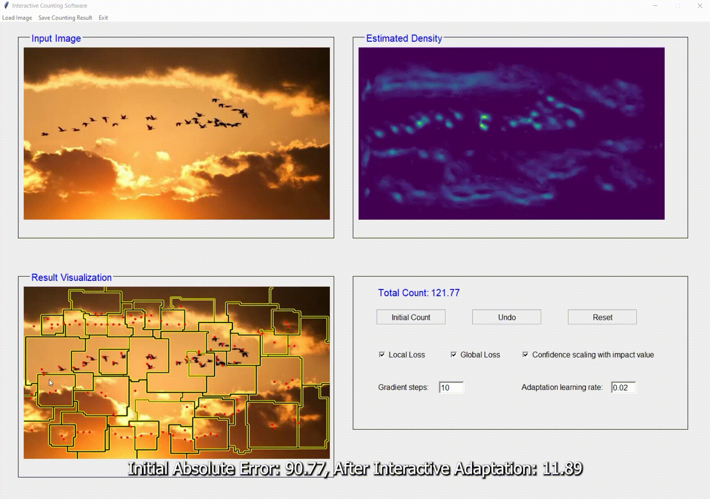

# **[ICCV23] Interactive Class-Agnostic Object Counting**

Our work using user interaction to improve class-agnostic visual counter.



## Contact
If you have any problems please contact yifehuang@cs.stonybrook.edu

## To-Do List
- [x] Colab
- [ ] Environment Set up
- [ ] Script for segment density map
- [ ] Script for Visualization 
- [ ] Original Interface
- [ ] Interface with exemplar providing
- [ ] Hugging Face
## Data and Checkpoints
[Google Drive](https://drive.google.com/drive/folders/1uEFHgqmnsDugelC7bYGUnE32fWkz87Hs?usp=sharing) <br>


```
wget --load-cookies /tmp/cookies.txt "https://docs.google.com/uc?export=download&confirm=$(wget --quiet --save-cookies /tmp/cookies.txt --keep-session-cookies --no-check-certificate 'https://docs.google.com/uc?export=download&id=1ai8bPEKogyms_W1qBDvokdSd8tzimGSI' -O- | sed -rn 's/.*confirm=([0-9A-Za-z_]+).*/\1\n/p')&id=1ai8bPEKogyms_W1qBDvokdSd8tzimGSI" -O ExCount.zip && rm -rf /tmp/cookies.txt
```

## Data and Checkpoints
Download on [Google Drive](https://drive.google.com/drive/folders/1uEFHgqmnsDugelC7bYGUnE32fWkz87Hs?usp=sharing) or: <br> 

Data:
```
wget --load-cookies /tmp/cookies.txt "https://docs.google.com/uc?export=download&confirm=$(wget --quiet --save-cookies /tmp/cookies.txt --keep-session-cookies --no-check-certificate 'https://docs.google.com/uc?export=download&id=1rI1dcUaR47EOQL3jJaRyjhF15ycHzUCU' -O- | sed -rn 's/.*confirm=([0-9A-Za-z_]+).*/\1\n/p')&id=1rI1dcUaR47EOQL3jJaRyjhF15ycHzUCU" -O data.zip && rm -rf /tmp/cookies.txt
```

Checkpoints:
```
wget --load-cookies /tmp/cookies.txt "https://docs.google.com/uc?export=download&confirm=$(wget --quiet --save-cookies /tmp/cookies.txt --keep-session-cookies --no-check-certificate 'https://docs.google.com/uc?export=download&id=1ljsiTu8NfUQ6x0cHlcX12iM8JQjeVRMr' -O- | sed -rn 's/.*confirm=([0-9A-Za-z_]+).*/\1\n/p')&id=1ljsiTu8NfUQ6x0cHlcX12iM8JQjeVRMr" -O checkpoints.zip && rm -rf /tmp/cookies.txt
```
## Experiment Reproduction

### FamNet [](https://colab.research.google.com/drive/1JlaJi4tBtvbv6vL2LWAcy7LsER-vgIgB?usp=sharing)
FSC-147:
```
cd Scripts
sh famnet_fsc.sh
```
FSCD-LVIS
```
cd Scripts
sh famnet_lvis.sh
```
### BMNet
FSC-147:
```
cd Scripts
sh bmnet_fsc.sh
```
FSCD-LVIS
```
cd Scripts
sh bmnet_lvis.sh
```
### SAFECount
FSC-147:
```
cd Scripts
sh safecount_fsc.sh
```
FSCD-LVIS
```
cd Scripts
sh safecount_lvis.sh
```

